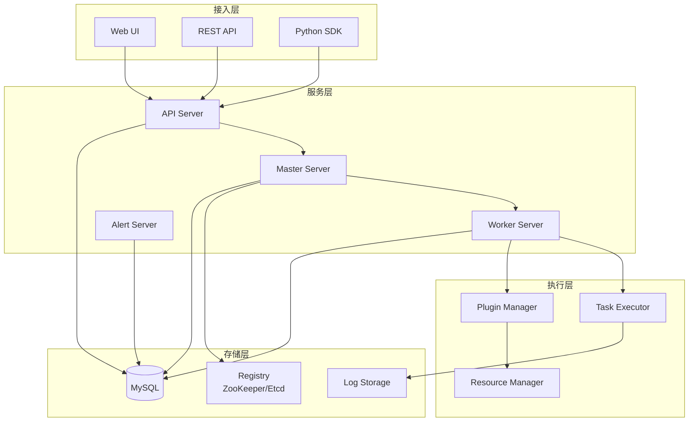
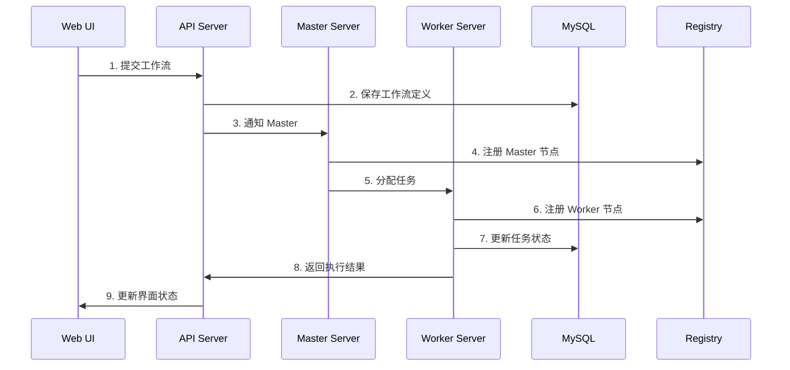

# DolphinScheduler 架构与模块分析

## 高层架构图

### 整体架构概览



### 核心组件关系



## 核心模块拆解

### 1. Master Server (调度中心)

#### 核心职责 (Responsibility)
- **工作流调度**：负责任务的调度和分发
- **资源管理**：管理 Worker 节点的资源分配
- **状态管理**：维护工作流和任务的状态
- **故障恢复**：处理 Worker 节点故障和任务重试

#### 关键数据结构 (Data Structures)
```java
// 工作流实例
public class ProcessInstance {
    private int id;
    private String name;
    private ProcessDefinition processDefinition;
    private ExecutionStatus state;
    private Date startTime;
    private Date endTime;
    // ...
}

// 任务实例
public class TaskInstance {
    private int id;
    private String name;
    private TaskDefinition taskDefinition;
    private ExecutionStatus state;
    private String host;
    private Date startTime;
    private Date endTime;
    // ...
}

// 调度队列
public class TaskPriorityQueue {
    private PriorityBlockingQueue<TaskInstance> queue;
    // ...
}
```

#### 主要接口 (Interfaces)
```java
// 工作流执行服务
public interface WorkflowExecuteService {
    void submitWorkflow(ProcessInstance processInstance);
    void pauseWorkflow(int processInstanceId);
    void resumeWorkflow(int processInstanceId);
    void stopWorkflow(int processInstanceId);
}

// 任务调度服务
public interface TaskScheduleService {
    void submitTask(TaskInstance taskInstance);
    void dispatchTask(TaskInstance taskInstance);
    void handleTaskResponse(TaskResponse response);
}
```

#### 依赖关系 (Dependencies)
- **dolphinscheduler-dao**：数据访问层
- **dolphinscheduler-common**：公共工具类
- **dolphinscheduler-registry**：注册中心
- **dolphinscheduler-eventbus**：事件总线

### 2. Worker Server (执行节点)

#### 核心职责 (Responsibility)
- **任务执行**：执行具体的任务逻辑
- **资源监控**：监控本地资源使用情况
- **心跳上报**：向 Master 报告节点状态
- **日志管理**：收集和管理任务执行日志

#### 关键数据结构 (Data Structures)
```java
// 任务执行器
public class TaskExecutor {
    private String taskType;
    private TaskChannel taskChannel;
    private TaskExecutionContext context;
    // ...
}

// 执行上下文
public class TaskExecutionContext {
    private int taskInstanceId;
    private String taskParams;
    private String dataSource;
    private String sqlType;
    private String sql;
    // ...
}

// 资源信息
public class WorkerResourceInfo {
    private String host;
    private int cpuUsage;
    private long memoryUsage;
    private int availableCpu;
    private long availableMemory;
    // ...
}
```

#### 主要接口 (Interfaces)
```java
// 任务执行服务
public interface TaskExecuteService {
    void executeTask(TaskInstance taskInstance);
    void killTask(int taskInstanceId);
    TaskResponse getTaskResponse(int taskInstanceId);
}

// 资源监控服务
public interface ResourceMonitorService {
    WorkerResourceInfo getResourceInfo();
    boolean isResourceAvailable();
    void updateResourceUsage();
}
```

#### 依赖关系 (Dependencies)
- **dolphinscheduler-dao**：数据访问层
- **dolphinscheduler-common**：公共工具类
- **dolphinscheduler-task-plugin**：任务插件
- **dolphinscheduler-registry**：注册中心

### 3. API Server (接口服务)

#### 核心职责 (Responsibility)
- **REST API**：提供 HTTP 接口服务
- **权限控制**：处理用户认证和授权
- **参数验证**：验证请求参数的合法性
- **响应封装**：统一处理响应格式

#### 关键数据结构 (Data Structures)
```java
// API 响应
public class Result<T> {
    private Integer code;
    private String msg;
    private T data;
    // ...
}

// 分页结果
public class PageInfo<T> {
    private List<T> totalList;
    private Integer total;
    private Integer totalPage;
    private Integer pageSize;
    private Integer currentPage;
    // ...
}

// 用户会话
public class Session {
    private String sessionId;
    private User user;
    private Date createTime;
    private Date lastAccessTime;
    // ...
}
```

#### 主要接口 (Interfaces)
```java
// 工作流管理接口
@RestController
@RequestMapping("/workflow")
public class WorkflowController {
    @PostMapping("/create")
    public Result<ProcessDefinition> createWorkflow(@RequestBody WorkflowCreateRequest request);
    
    @PostMapping("/submit")
    public Result<ProcessInstance> submitWorkflow(@RequestBody WorkflowSubmitRequest request);
    
    @GetMapping("/list")
    public Result<PageInfo<ProcessDefinition>> listWorkflows(@RequestParam WorkflowListRequest request);
}

// 项目管理接口
@RestController
@RequestMapping("/project")
public class ProjectController {
    @PostMapping("/create")
    public Result<Project> createProject(@RequestBody ProjectCreateRequest request);
    
    @GetMapping("/list")
    public Result<PageInfo<Project>> listProjects(@RequestParam ProjectListRequest request);
}
```

#### 依赖关系 (Dependencies)
- **dolphinscheduler-service**：业务服务层
- **dolphinscheduler-dao**：数据访问层
- **dolphinscheduler-common**：公共工具类
- **dolphinscheduler-authentication**：认证模块

### 4. Service Layer (业务服务层)

#### 核心职责 (Responsibility)
- **业务逻辑**：实现核心业务逻辑
- **事务管理**：管理数据库事务
- **数据转换**：处理数据格式转换
- **业务规则**：实现业务规则和约束

#### 关键数据结构 (Data Structures)
```java
// 工作流服务
public class WorkflowService {
    private ProcessDefinitionMapper processDefinitionMapper;
    private ProcessInstanceMapper processInstanceMapper;
    private WorkflowExecuteService workflowExecuteService;
    // ...
}

// 任务服务
public class TaskService {
    private TaskDefinitionMapper taskDefinitionMapper;
    private TaskInstanceMapper taskInstanceMapper;
    private TaskScheduleService taskScheduleService;
    // ...
}

// 用户服务
public class UserService {
    private UserMapper userMapper;
    private PermissionService permissionService;
    // ...
}
```

#### 主要接口 (Interfaces)
```java
// 工作流服务接口
public interface WorkflowService {
    ProcessDefinition createWorkflow(WorkflowCreateRequest request);
    ProcessInstance submitWorkflow(WorkflowSubmitRequest request);
    void updateWorkflow(WorkflowUpdateRequest request);
    void deleteWorkflow(int workflowId);
    PageInfo<ProcessDefinition> listWorkflows(WorkflowListRequest request);
}

// 任务服务接口
public interface TaskService {
    TaskDefinition createTask(TaskCreateRequest request);
    void updateTask(TaskUpdateRequest request);
    void deleteTask(int taskId);
    TaskInstance getTaskInstance(int taskInstanceId);
}
```

#### 依赖关系 (Dependencies)
- **dolphinscheduler-dao**：数据访问层
- **dolphinscheduler-common**：公共工具类
- **dolphinscheduler-master**：Master 服务
- **dolphinscheduler-worker**：Worker 服务

### 5. DAO Layer (数据访问层)

#### 核心职责 (Responsibility)
- **数据持久化**：负责数据的增删改查
- **SQL 优化**：优化数据库查询性能
- **连接管理**：管理数据库连接池
- **事务处理**：处理数据库事务

#### 关键数据结构 (Data Structures)
```java
// 数据源配置
public class DataSource {
    private String name;
    private String type;
    private String host;
    private int port;
    private String database;
    private String username;
    private String password;
    // ...
}

// 数据库连接池
public class ConnectionPool {
    private DataSource dataSource;
    private int maxConnections;
    private int minConnections;
    private long maxWaitTime;
    // ...
}
```

#### 主要接口 (Interfaces)
```java
// 工作流定义 Mapper
public interface ProcessDefinitionMapper {
    int insert(ProcessDefinition processDefinition);
    int update(ProcessDefinition processDefinition);
    int deleteById(int id);
    ProcessDefinition selectById(int id);
    List<ProcessDefinition> selectByProjectId(int projectId);
}

// 任务实例 Mapper
public interface TaskInstanceMapper {
    int insert(TaskInstance taskInstance);
    int update(TaskInstance taskInstance);
    TaskInstance selectById(int id);
    List<TaskInstance> selectByProcessInstanceId(int processInstanceId);
}
```

#### 依赖关系 (Dependencies)
- **dolphinscheduler-common**：公共工具类
- **dolphinscheduler-datasource-plugin**：数据源插件
- **MySQL/PostgreSQL**：数据库

## 核心设计模式

### 1. 观察者模式 (Observer Pattern)
用于事件通知和状态同步：
```java
// 事件总线
public class EventBus {
    private Map<EventType, List<EventListener>> listeners;
    
    public void publish(Event event);
    public void subscribe(EventType type, EventListener listener);
}

// 事件监听器
public interface EventListener {
    void onEvent(Event event);
}
```

### 2. 策略模式 (Strategy Pattern)
用于不同类型的任务执行：
```java
// 任务执行策略
public interface TaskExecuteStrategy {
    void execute(TaskExecutionContext context);
}

// 具体策略实现
public class SqlTaskExecuteStrategy implements TaskExecuteStrategy {
    @Override
    public void execute(TaskExecutionContext context) {
        // SQL 任务执行逻辑
    }
}

public class ShellTaskExecuteStrategy implements TaskExecuteStrategy {
    @Override
    public void execute(TaskExecutionContext context) {
        // Shell 任务执行逻辑
    }
}
```

### 3. 工厂模式 (Factory Pattern)
用于创建不同类型的组件：
```java
// 任务执行器工厂
public class TaskExecutorFactory {
    public static TaskExecutor createExecutor(String taskType) {
        switch (taskType) {
            case "SQL":
                return new SqlTaskExecutor();
            case "SHELL":
                return new ShellTaskExecutor();
            case "PYTHON":
                return new PythonTaskExecutor();
            default:
                throw new IllegalArgumentException("Unknown task type: " + taskType);
        }
    }
}
```

### 4. 模板方法模式 (Template Method Pattern)
用于工作流执行的标准流程：
```java
// 工作流执行模板
public abstract class WorkflowExecuteTemplate {
    
    public final void execute(ProcessInstance processInstance) {
        preExecute(processInstance);
        doExecute(processInstance);
        postExecute(processInstance);
    }
    
    protected abstract void preExecute(ProcessInstance processInstance);
    protected abstract void doExecute(ProcessInstance processInstance);
    protected abstract void postExecute(ProcessInstance processInstance);
}
```

## 关键技术特性

### 1. 分布式协调
- **ZooKeeper/Etcd**：用于服务注册和发现
- **分布式锁**：保证任务调度的唯一性
- **配置管理**：动态配置更新

### 2. 高可用设计
- **Master 多实例**：支持多个 Master 节点
- **Worker 集群**：支持动态扩缩容
- **故障转移**：自动故障检测和恢复

### 3. 插件化架构
- **任务插件**：支持自定义任务类型
- **数据源插件**：支持多种数据源
- **告警插件**：支持多种告警方式

### 4. 性能优化
- **连接池**：数据库连接复用
- **缓存机制**：减少数据库访问
- **异步处理**：提高并发性能

## 学习建议

### 1. 模块学习顺序
1. **从 API Server 开始**：理解接口设计和业务逻辑
2. **深入 Service Layer**：掌握核心业务实现
3. **研究 DAO Layer**：了解数据访问模式
4. **分析 Master Server**：理解调度逻辑
5. **探索 Worker Server**：掌握任务执行机制

### 2. 重点关注
- **工作流状态机**：理解状态转换逻辑
- **任务调度算法**：掌握调度策略
- **分布式协调**：了解一致性保证
- **插件机制**：学习扩展性设计

### 3. 实践建议
- **绘制时序图**：梳理关键流程
- **编写单元测试**：验证理解正确性
- **性能测试**：了解系统瓶颈
- **源码注释**：记录学习心得