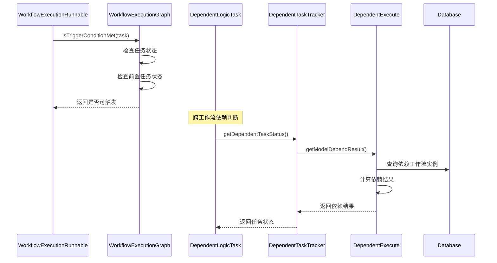

# DolphinScheduler 依赖任务判断细节深度解析

## 概述

DolphinScheduler中的依赖判断是整个任务调度系统的核心机制之一。本文档基于源码深入分析依赖任务的判断细节，包括DAG内部依赖、跨工作流依赖、以及各种复杂的依赖场景。

## 1. 依赖判断的层次结构

### 1.1 DAG内部依赖判断 (WorkflowExecutionGraph)

#### 核心接口：`isTriggerConditionMet`

```java
@Override
public boolean isTriggerConditionMet(final ITaskExecutionRunnable taskExecutionRunnable) {
    // 1. 检查任务是否已经在活跃状态或已完成
    if (isTaskExecutionRunnableActive(taskExecutionRunnable)
            || isTaskExecutionRunnableInActive(taskExecutionRunnable)) {
        return false;
    }
    
    // 2. 检查所有前置任务的状态
    return getPredecessors(taskExecutionRunnable.getName())
            .stream()
            .allMatch(predecessor -> isTaskExecutionRunnableInActive(predecessor)
                    && !isTaskExecutionRunnableFailed(predecessor)
                    && !isTaskExecutionRunnablePaused(predecessor)
                    && !isTaskExecutionRunnableKilled(predecessor));
}
```

#### 判断条件详解：

1. **任务状态检查**：
   - 任务不能处于`Active`状态（正在执行）
   - 任务不能处于`InActive`状态（已执行完成）

2. **前置任务状态检查**：
   - 所有前置任务必须已完成（`InActive`）
   - 所有前置任务不能是失败状态（`Failed`）
   - 所有前置任务不能是暂停状态（`Paused`）
   - 所有前置任务不能是终止状态（`Killed`）

### 1.2 跨工作流依赖判断 (DependentLogicTask)

跨工作流依赖通过专门的`DependentLogicTask`来实现，这是一个逻辑任务类型。

#### 依赖类型分类：

1. **依赖整个工作流** (`DEPENDENT_WORKFLOW_CODE`)
2. **依赖工作流中的所有任务** (`DEPENDENT_ALL_TASK_CODE`)
3. **依赖工作流中的特定任务** (具体的任务代码)

## 2. 依赖任务跟踪器 (DependentTaskTracker)

### 2.1 初始化过程

```java
public DependentTaskTracker(TaskExecutionContext taskExecutionContext,
                            DependentParameters dependentParameters,
                            ProjectDao projectDao,
                            WorkflowDefinitionDao workflowDefinitionDao,
                            TaskDefinitionDao taskDefinitionDao,
                            TaskInstanceDao taskInstanceDao,
                            WorkflowInstanceDao workflowInstanceDao,
                            TaskInstanceContextDao taskInstanceContextDao) {
    // 1. 计算依赖日期
    this.dependentDate = calculateDependentDate();
    
    // 2. 初始化依赖任务列表
    this.dependentTaskList = initializeDependentTaskList();
    
    // 3. 初始化结果映射
    this.dependResultMap = new HashMap<>();
    this.dependVarPoolPropertyMap = new HashMap<>();
}
```

### 2.2 依赖日期计算

```java
private Date calculateDependentDate() {
    if (workflowInstance.getScheduleTime() != null) {
        return workflowInstance.getScheduleTime();  // 使用调度时间
    } else {
        return new Date();  // 使用当前时间
    }
}
```

## 3. 依赖执行器 (DependentExecute)

### 3.1 依赖项判断的核心逻辑

```java
public DependResult getModelDependResult(Date currentTime, int testFlag) {
    List<DependResult> dependResultList = new ArrayList<>();

    for (DependentItem dependentItem : dependItemList) {
        // 自依赖特殊处理
        if (isSelfDependent(dependentItem) && isFirstWorkflowInstance(dependentItem)) {
            dependResultMap.put(dependentItem.getKey(), DependResult.SUCCESS);
            dependResultList.add(DependResult.SUCCESS);
            continue;
        }
        
        // 获取依赖项结果
        DependResult dependResult = getDependResultForItem(dependentItem, currentTime, testFlag);
        if (dependResult != DependResult.WAITING) {
            dependResultMap.put(dependentItem.getKey(), dependResult);
        }
        dependResultList.add(dependResult);
    }
    
    // 根据依赖关系计算最终结果
    return DependentUtils.getDependResultForRelation(this.relation, dependResultList);
}
```

### 3.2 时间区间计算

依赖判断支持多种时间周期：

```java
public static List<DateInterval> getDateIntervalList(Date businessDate, String dateValue) {
    switch (dateValue) {
        case "currentHour":     // 当前小时
        case "last1Hour":       // 前1小时
        case "last2Hours":      // 前2小时
        case "last3Hours":      // 前3小时
        case "last24Hours":     // 前24小时
        case "today":           // 今天
        case "last1Days":       // 前1天
        case "last2Days":       // 前2天
        case "last3Days":       // 前3天
        case "last7Days":       // 前7天
        case "thisWeek":        // 本周
        case "lastWeek":        // 上周
        case "lastMonday":      // 上周一
        case "thisMonth":       // 本月
        case "lastMonth":       // 上月
        // ... 更多时间周期
    }
}
```

## 4. 依赖判断的具体实现

### 4.1 依赖整个工作流

```java
private DependResult dependResultByWorkflowInstance(WorkflowInstance workflowInstance) {
    // 1. 检查工作流是否完成
    if (!workflowInstance.getState().isFinished()) {
        return DependResult.WAITING;
    }
    
    // 2. 检查工作流是否成功
    if (workflowInstance.getState().isSuccess()) {
        addItemVarPool(workflowInstance.getVarPool(), workflowInstance.getEndTime().getTime());
        return DependResult.SUCCESS;
    }
    
    // 3. 工作流失败
    return DependResult.FAILED;
}
```

### 4.2 依赖工作流中的所有任务

```java
private DependResult dependResultByAllTaskOfWorkflowInstance(WorkflowInstance workflowInstance, int testFlag) {
    // 1. 检查工作流是否完成
    if (!workflowInstance.getState().isFinished()) {
        return DependResult.WAITING;
    }
    
    if (workflowInstance.getState().isSuccess()) {
        // 2. 获取工作流中的所有任务定义
        List<WorkflowTaskRelation> workflowTaskRelations = 
            processService.findRelationByCode(workflowInstance.getWorkflowDefinitionCode(),
                                            workflowInstance.getWorkflowDefinitionVersion());
        
        // 3. 获取任务实例列表
        List<TaskInstance> taskInstanceList = 
            taskInstanceDao.queryLastTaskInstanceListIntervalInWorkflowInstance(
                workflowInstance.getId(), taskDefinitionCodeMap.keySet(), testFlag);
        
        // 4. 检查每个任务的执行状态
        for (Long taskCode : taskDefinitionCodeMap.keySet()) {
            if (!taskExecutionStatusMap.containsKey(taskCode)) {
                return DependResult.FAILED;  // 任务未执行
            } else {
                if (!taskExecutionStatusMap.get(taskCode).isSuccess()) {
                    return DependResult.FAILED;  // 任务执行失败
                }
            }
        }
        
        return DependResult.SUCCESS;
    }
    return DependResult.FAILED;
}
```

### 4.3 依赖特定任务

```java
private DependResult dependResultBySingleTaskInstance(WorkflowInstance workflowInstance, 
                                                     long depTaskCode, int testFlag) {
    // 1. 查询任务实例
    TaskInstance taskInstance = taskInstanceDao.queryLastTaskInstanceIntervalInWorkflowInstance(
        workflowInstance.getId(), depTaskCode, testFlag);

    if (taskInstance == null) {
        TaskDefinition taskDefinition = taskDefinitionDao.queryByCode(depTaskCode);
        
        // 2. 检查任务定义是否存在
        if (taskDefinition == null) {
            return DependResult.FAILED;
        }

        // 3. 检查任务是否被禁用
        if (taskDefinition.getFlag() == Flag.NO) {
            return DependResult.SUCCESS;  // 禁用的任务默认成功
        }

        // 4. 检查工作流是否完成
        if (!workflowInstance.getState().isFinished()) {
            return DependResult.WAITING;
        }

        return DependResult.FAILED;
    } else {
        // 5. 流式任务特殊处理
        if (TaskExecuteType.STREAM == taskInstance.getTaskExecuteType()) {
            return DependResult.SUCCESS;
        }
        
        // 6. 获取任务执行结果
        return getDependResultOfTask(workflowInstance, taskInstance);
    }
}
```

## 5. 工作流候选实例查找

### 5.1 查找策略

```java
private WorkflowInstance findDependentWorkflowCandidate(Long definitionCode, Long taskCode,
                                                       DateInterval dateInterval, int testFlag) {
    // 1. 优先查找正在运行的工作流实例
    WorkflowInstance runningWorkflow = 
        workflowInstanceDao.queryLastRunningWorkflowInterval(definitionCode, dateInterval);
    if (runningWorkflow != null) {
        return runningWorkflow;
    }

    // 2. 查找最后一个调度执行的工作流实例
    WorkflowInstance lastSchedulerWorkflowInstance = 
        workflowInstanceDao.queryLastSchedulerWorkflowInterval(definitionCode, taskCode, dateInterval, testFlag);

    // 3. 查找最后一个手动执行的工作流实例
    WorkflowInstance lastManualWorkflowInstance = 
        workflowInstanceDao.queryLastManualWorkflowInterval(definitionCode, taskCode, dateInterval, testFlag);

    // 4. 返回最新的工作流实例
    if (lastManualWorkflowInstance == null) {
        return lastSchedulerWorkflowInstance;
    }
    if (lastSchedulerWorkflowInstance == null) {
        return lastManualWorkflowInstance;
    }

    return lastManualWorkflowInstance.getId() > lastSchedulerWorkflowInstance.getId() 
        ? lastManualWorkflowInstance : lastSchedulerWorkflowInstance;
}
```

## 6. 依赖关系计算

### 6.1 AND关系

```java
case AND:
    if (dependResultList.contains(DependResult.FAILED)) {
        dependResult = DependResult.FAILED;      // 任何一个失败，整体失败
    } else if (dependResultList.contains(DependResult.WAITING)) {
        dependResult = DependResult.WAITING;     // 任何一个等待，整体等待
    } else {
        dependResult = DependResult.SUCCESS;     // 全部成功，整体成功
    }
    break;
```

### 6.2 OR关系

```java
case OR:
    if (dependResultList.contains(DependResult.SUCCESS)) {
        dependResult = DependResult.SUCCESS;     // 任何一个成功，整体成功
    } else if (dependResultList.contains(DependResult.WAITING)) {
        dependResult = DependResult.WAITING;     // 存在等待且无成功，整体等待
    } else {
        dependResult = DependResult.FAILED;      // 全部失败，整体失败
    }
    break;
```

## 7. 特殊场景处理

### 7.1 自依赖处理

```java
public boolean isSelfDependent(DependentItem dependentItem) {
    if (workflowInstance.getWorkflowDefinitionCode().equals(dependentItem.getDefinitionCode())) {
        if (dependentItem.getDepTaskCode() == Constants.DEPENDENT_ALL_TASK_CODE) {
            return true;  // 依赖自己工作流的所有任务
        }
        if (dependentItem.getDepTaskCode() == taskInstance.getTaskCode()) {
            return true;  // 依赖自己任务
        }
    }
    return false;
}

public boolean isFirstWorkflowInstance(DependentItem dependentItem) {
    WorkflowInstance firstWorkflowInstance = 
        workflowInstanceDao.queryFirstScheduleWorkflowInstance(dependentItem.getDefinitionCode());
    if (firstWorkflowInstance == null) {
        firstWorkflowInstance = 
            workflowInstanceDao.queryFirstStartWorkflowInstance(dependentItem.getDefinitionCode());
    }
    return Objects.equals(firstWorkflowInstance.getId(), workflowInstance.getId());
}
```

### 7.2 流式任务处理

流式任务（Stream Task）由于其持续运行的特性，在依赖判断时有特殊处理：

```java
if (TaskExecuteType.STREAM == taskInstance.getTaskExecuteType()) {
    // 流式任务默认返回成功
    addItemVarPool(taskInstance.getVarPool(), taskInstance.getEndTime().getTime());
    return DependResult.SUCCESS;
}
```

### 7.3 禁用任务处理

```java
if (taskDefinition.getFlag() == Flag.NO) {
    // 禁用的任务在依赖检查时默认成功
    return DependResult.SUCCESS;
}
```

## 8. 后续流程调整 (SuccessorFlowAdjuster)

### 8.1 条件任务流程调整

```java
private void adjustConditionTaskSuccessorFlow(final ITaskExecutionRunnable taskExecutionRunnable) {
    final ConditionsParameters conditionsParameters = 
        JSONUtils.parseObject(taskParams, ConditionsParameters.class);
    
    final ConditionsParameters.ConditionResult conditionResult = 
        conditionsParameters.getConditionResult();
    
    final List<Long> needSkippedBranch;
    if (conditionResult.isConditionSuccess()) {
        needSkippedBranch = conditionResult.getFailedNode();    // 跳过失败分支
    } else {
        needSkippedBranch = conditionResult.getSuccessNode();   // 跳过成功分支
    }
    markTaskSkipped(taskExecutionRunnable, needSkippedBranch);
}
```

### 8.2 Switch任务流程调整

```java
private void adjustSwitchTaskSuccessorFlow(final ITaskExecutionRunnable taskExecutionRunnable) {
    final SwitchParameters switchParameters = 
        JSONUtils.parseObject(taskParams, SwitchParameters.class);
    
    final SwitchParameters.SwitchResult switchResult = switchParameters.getSwitchResult();
    
    final Set<Long> needSkippedBranch = new HashSet<>();
    // 收集所有可能的分支
    if (switchResult.getNextNode() != null) {
        needSkippedBranch.add(switchResult.getNextNode());
    }
    if (CollectionUtils.isNotEmpty(switchResult.getDependTaskList())) {
        for (SwitchResultVo switchResultVo : switchResult.getDependTaskList()) {
            needSkippedBranch.add(switchResultVo.getNextNode());
        }
    }
    // 移除实际选择的分支
    needSkippedBranch.remove(switchParameters.getNextBranch());
    markTaskSkipped(taskExecutionRunnable, needSkippedBranch);
}
```

## 9. 依赖状态枚举

```java
public enum DependResult {
    SUCCESS,    // 依赖成功
    FAILED,     // 依赖失败  
    WAITING     // 依赖等待
}

public enum DependentRelation {
    AND,        // 与关系：所有依赖都成功才成功
    OR          // 或关系：任一依赖成功即成功
}
```

## 10. 关键时序图



## 11. 最佳实践建议

### 11.1 依赖设计原则

1. **避免循环依赖**：确保DAG的无环性
2. **合理使用依赖关系**：AND用于强依赖，OR用于弱依赖
3. **时间窗口设置**：根据业务需求合理设置依赖时间窗口
4. **自依赖谨慎使用**：避免不必要的自依赖

### 11.2 性能优化

1. **依赖深度控制**：避免过深的依赖链
2. **批量查询优化**：减少数据库查询次数
3. **缓存机制**：对频繁查询的依赖结果进行缓存

### 11.3 监控告警

1. **依赖等待超时告警**
2. **依赖失败率监控**
3. **依赖链路追踪**

## 总结

DolphinScheduler的依赖判断机制通过多层次的设计，支持了从简单的DAG内部依赖到复杂的跨工作流依赖的各种场景。其核心特点包括：

1. **分层设计**：DAG内部依赖和跨工作流依赖分别处理
2. **状态驱动**：基于任务和工作流状态进行依赖判断
3. **时间感知**：支持多种时间周期的依赖设置
4. **灵活配置**：支持AND/OR关系的依赖组合
5. **特殊场景处理**：对自依赖、流式任务、禁用任务等特殊场景有专门处理

这种设计既保证了依赖判断的准确性，又提供了足够的灵活性来应对复杂的业务场景。